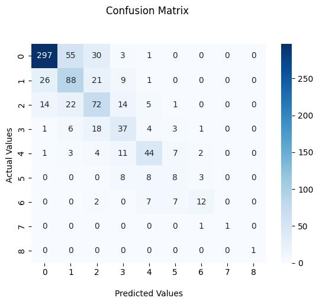

# Automatic evaluation of Nail Psoriasis Severity Index using deep learning algorithm (YOLO v7)


<div align="center">
    <a href="./">
        
    </a>
</div>


## Performance 


|         | Accuracy |  MAE  |  ICC  | 
|:--------|:--------:|:-----:|:-----:|
| NAPSI-M |  79.5%   | 0.279 | 0.876 | 
| NAPSI-B |  81.1%   | 0.253 | 0.647 |
| NAPSI   |  65.2%   | 0.488 | 0.853 | 

## Installation
To clone a repository into PyCharm, use the 'git clone' command followed by the repository URL, allowing for seamless integration and management of project files within the PyCharm IDE environment.

Confirmed that the program runs well on RTX3080, CUDA 11.2, cuDNN 8.1.0, Ubuntu 20.04

Tested with: Python 3.8.10, Pytorch 1.7.0+cu110


</details>

## Preperation
Cropped single nail images should be in '/napsi_training_image'
Annotation textfile should be in '/napsi_training_label'

Cropped single nail images for test should be in '/napsi_test_images'

## Testing

``` shell
source detection_script.sh
```

You will get the results in 

'runs/detect/matrix/matrix_result.csv' and 'runs/detect/bed/bed_result.csv'

If you add the subscores of component 1 to component 4 from matrix_result.csv and bed_result.csv, you can calculate the NAPSI-M and NAPSI-B scores.


## Training

GPU training

``` shell
 source training_script.sh
```

## Citation

```
@inproceedings{wang2023yolov7,
  title={{YOLOv7}: Trainable bag-of-freebies sets new state-of-the-art for real-time object detectors},
  author={Wang, Chien-Yao and Bochkovskiy, Alexey and Liao, Hong-Yuan Mark},
  booktitle={Proceedings of the IEEE/CVF Conference on Computer Vision and Pattern Recognition (CVPR)},
  year={2023}
}
```


## Acknowledgements
This deep learning algorithm uses YOLO v7, designed by Chien-Yao Wang, as its backbone
